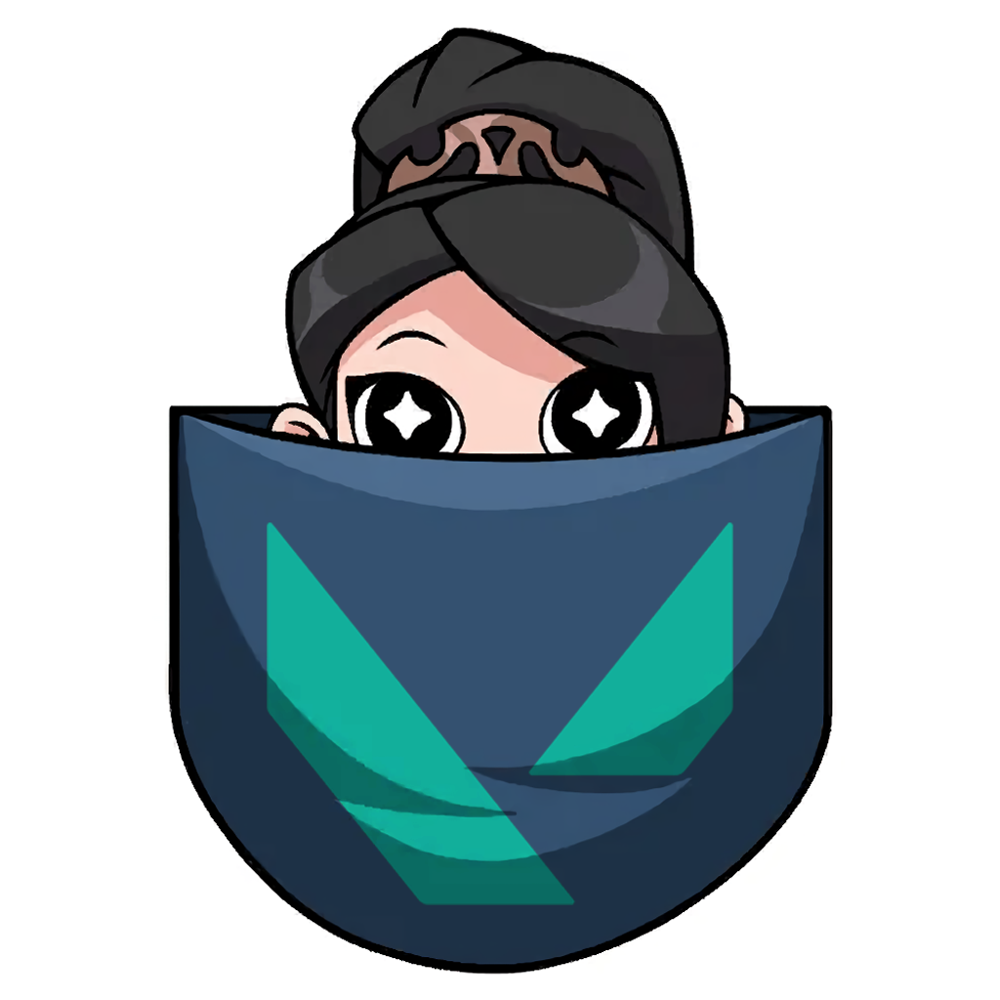
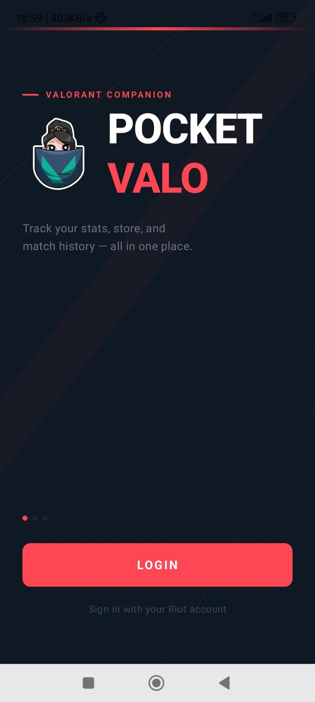
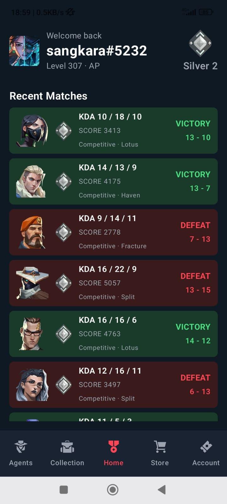
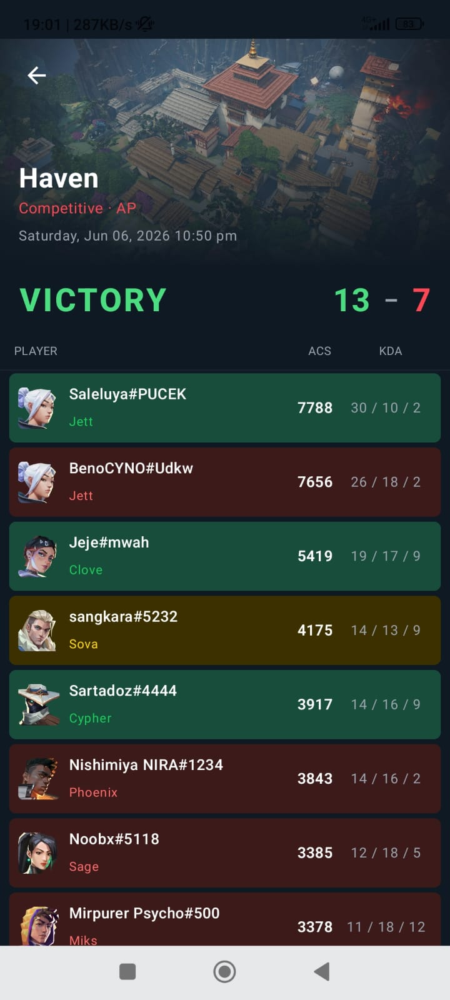
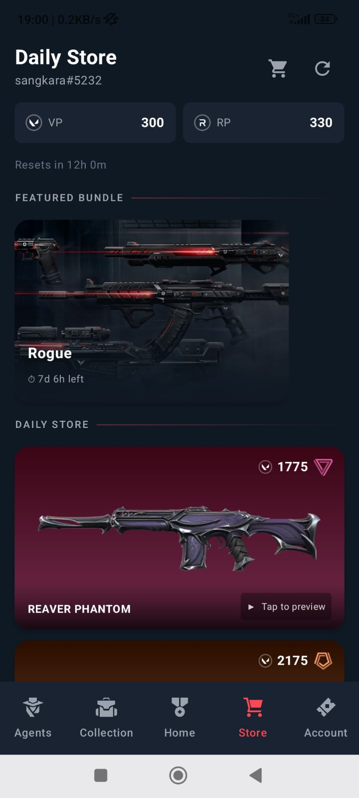
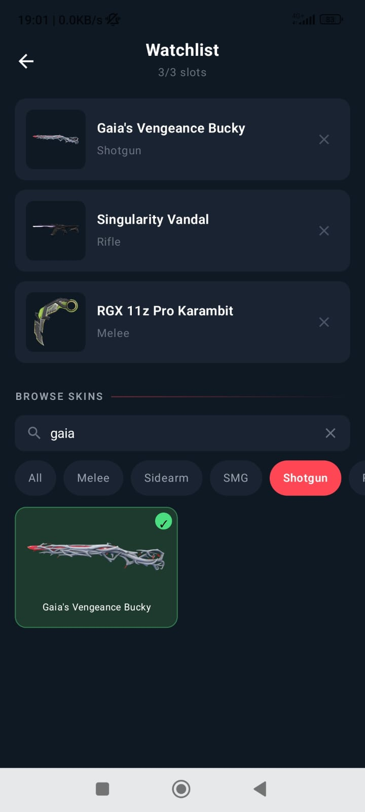
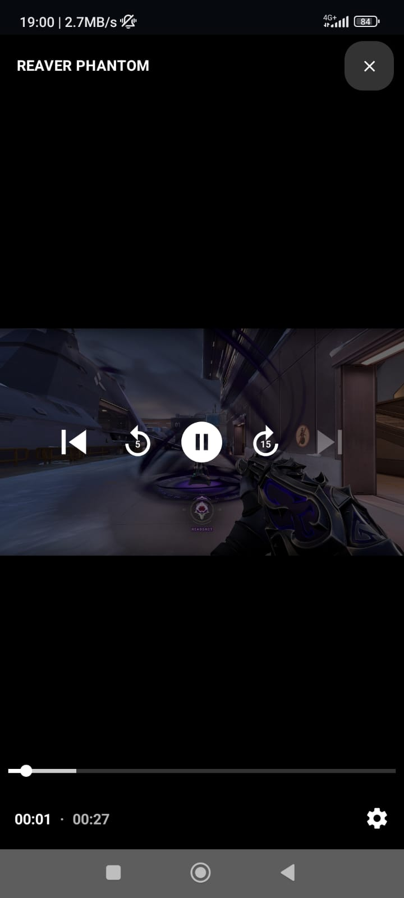
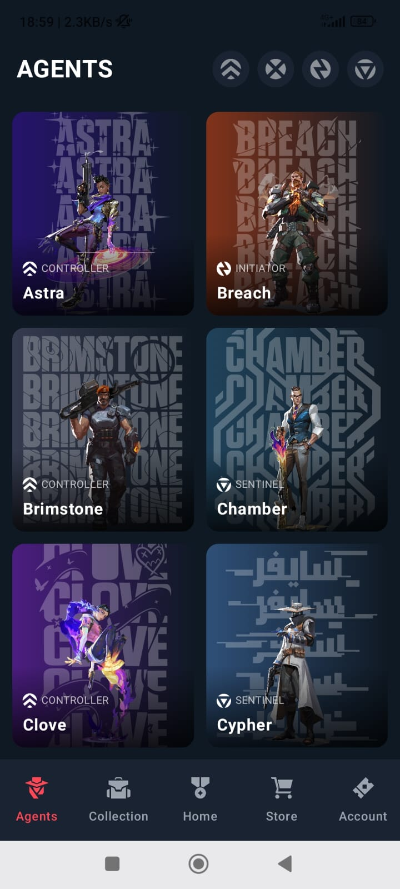

<div align="center">

```
██████╗  ██████╗  ██████╗██╗  ██╗███████╗████████╗    ██╗   ██╗ █████╗ ██╗      ██████╗
██╔══██╗██╔═══██╗██╔════╝██║ ██╔╝██╔════╝╚══██╔══╝    ██║   ██║██╔══██╗██║     ██╔═══██╗
██████╔╝██║   ██║██║     █████╔╝ █████╗     ██║       ██║   ██║███████║██║     ██║   ██║
██╔═══╝ ██║   ██║██║     ██╔═██╗ ██╔══╝     ██║       ╚██╗ ██╔╝██╔══██║██║     ██║   ██║
██║     ╚██████╔╝╚██████╗██║  ██╗███████╗   ██║        ╚████╔╝ ██║  ██║███████╗╚██████╔╝
╚═╝      ╚═════╝  ╚═════╝╚═╝  ╚═╝╚══════╝   ╚═╝         ╚═══╝  ╚═╝  ╚═╝╚══════╝ ╚═════╝
```

**Your Valorant companion. Right in your pocket.**

[](https://android.com)
[](https://kotlinlang.org)
[](https://developer.android.com/jetpack/compose)
[](LICENSE)

</div>

<p align="center">
  
</p>

<p align="center">
  <a href="https://github.com/segawon-limo/Pocket_Valo/app/release/latest">
    
  </a>
</p>
---

## What is Pocket Valo?

Pocket Valo is an Android companion app for Valorant players. Check your daily store, Night Market, match history, agent roster, and weapon skins — all without opening the game.

Built with Kotlin + Jetpack Compose. Fast, clean, dark.

---

## Features

### 🛒 Daily Store & Night Market
- See your 4 daily skin offers with prices and tier badges
- Featured bundles with full weapon list and countdown timer
- Night Market with discount percentages per skin
- VP and RP balance at a glance

### 🔔 Skin Watchlist
- Watch up to 3 skins per account
- Daily background check via WorkManager
- Push notification when a watched skin appears in your store

### 📊 Match History
- Last 10 Competitive + Unrated matches
- Per-match stats: K/D/A, score, map, agent, result
- Match detail with full scoreboard — your team left, enemies right

### 🧬 Agents & Weapons
- Full agent roster with role filters (icon-based)
- Agent detail page with background gradient from API colors
- Weapons browser with equipped skin highlight per weapon

### 👥 Multi-Account
- Add and switch between multiple Riot accounts
- Per-account token storage with EncryptedSharedPreferences
- Switch account → auto reload all data for new account

### 🔐 Login
- Riot OAuth via WebView
- Custom keyboard overlay — fixes IME cursor-jump bug on Xiaomi/MIUI devices
- Back button dismisses keyboard gracefully

---

## Architecture

```
MVVM + Repository Pattern

UI Layer          → Jetpack Compose screens + ViewModels
Repository Layer  → StoreRepository, PlayerRepository, AssetsRepository, RiotAuthRepository
Local Storage     → Room DB (v7) + EncryptedSharedPreferences
Network           → OkHttp + Retrofit + Gson
Background        → WorkManager (daily watchlist check)
```

### API Sources

| Source | Usage |
|--------|-------|
| `api.henrikdev.xyz/valorant` | Player stats, match history, MMR |
| `auth.riotgames.com` | Riot OAuth login |
| `valorant-api.com` | Agents, weapons, maps, bundles, tiers, client version |
| `pd.{region}.a.pvp.net` | Store, Night Market, player loadout |

---

## Setup

### Prerequisites
- Android Studio Hedgehog or later
- Android SDK 26+
- A Riot Games account

### Build

```bash
git clone https://github.com/segawon-limo/Pocket_Valo.git
cd Pocket_Valo
./gradlew assembleDebug
```

Open in Android Studio and run on a device or emulator (API 26+).

> **Note:** This app uses the Riot Games OAuth flow via WebView. It is a companion/fan app and is not affiliated with or endorsed by Riot Games.

---

## Known Limitations

- **Token expiry** — Riot OAuth tokens expire after ~1 hour. Re-login required after expiry.
- **Store API version** — The app fetches the current `X-Riot-ClientVersion` from `valorant-api.com` at launch to stay compatible with Riot API updates.
- **Watchlist limit** — Max 3 skins per account due to notification UX constraints.

---

## Tech Stack

| Layer | Technology |
|-------|-----------|
| Language | Kotlin |
| UI | Jetpack Compose |
| Navigation | Navigation Compose |
| DI | Manual (singleton repositories) |
| Local DB | Room |
| Secure Storage | EncryptedSharedPreferences |
| Networking | OkHttp + Retrofit |
| Image Loading | Coil |
| Serialization | Gson |
| Background Work | WorkManager |
| Auth | Riot OAuth (WebView) |

---

## Screenshots

<p align="center">
  
  
  
  
  
  
  
</p>

---

<div align="center">

Made with ❤️ for the Valorant community

**Not affiliated with Riot Games**

</div>
